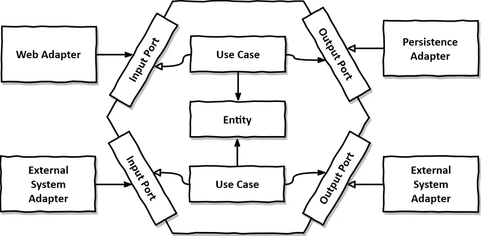

## Hexagonal Architecture

회사 선배와 함께 스파게티 코드(?)들로 구성된 프로젝트를 개선하기 위한 논의 중에 Hexagonal Architecture라는 것을 알게 되었고, 해당 내용에 대해 정리하려고 한다.

## Domain Objects
* Domain Object는 상태(state)와 동작(Behavior)을 포함 가능
* Behavior가 State에 가까울수록, 이해하기 쉽고 유지보수에 용이한 object
* **Domain Object는 Application에서 다른 계층(DB, Network)에 대한 종속성을 가지면 안된다.**
    -> 현재 우리 프로젝트의 코드는 전혀 위 규칙을 따르고 있지않는다. 가장 내부의 domain object가 외부 서비스를 호출하거나, db에 write한다.
* 위 규칙을 지켜서 구현 할 시, domain object의 Unit test에서 외부 서비스나 DB i/o 로직을 mocking 할 필요가 없으므로 TC 작성이 굉장히 쉬워진다
    -> 지금 우리 프로젝트의 Unit test는 domain object의 메서드에서 모든 외부 call을 mocking하므로 하나의 test가 거의 100줄이 넘어가는 경우도 있다...
* 대신 외부 서비스, DB i/o에 대해서는 Integration Test로 커버한다.
