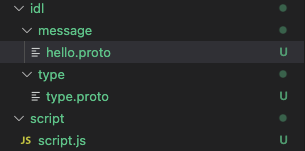

## Overview
회사에서 gRPC를 이용해서 k6 load testing을 진행하려고 했지만, 처음부터 난관에 봉착했다.
```
첫 번째로, .proto 정의 파일을 k6 script에 import 해오는 것.
두 번째로, 위 작업을 수행하기 전에, 현재 프로젝트 처럼 gradle, dotnet, go 로 빌드되어 bart에 올라가는 것처럼 javascript에서 사용될 수 있는 build 방식 확인해서 빌드하기
```

이제 k6를 시작하려고 하는데, 시작도 못하게 생겼다.
진작 gRPC에 관해서 공부를 해둘 걸...

이 글의 목적은
> **proto 파일을 포함한 폴더 자체를 packaging한 후, 해당 라이브러리를 import 하여 protobuf를 사용할 수 있도록 하는 것이다.** 

아래의 링크들을 참조하였다.
[k6 gRPC doc][1]


### Project 생성

이전에 생성한 sciprt 폴더에 proto file을 추가하여 프로젝트를 준비하였다.


> 물론 proto 파일을 직접 import 해서 사용하는 방법도 있는 것 같은데, 위의 목적에 맞게 진행할 것이다.


```protobuf
//hello.proto
syntax = "proto3";

package hello;

service HelloService {
  rpc SayHello(HelloRequest) returns (HelloResponse);
  rpc LotsOfReplies(HelloRequest) returns (stream HelloResponse);
  rpc LotsOfGreetings(stream HelloRequest) returns (HelloResponse);
  rpc BidiHello(stream HelloRequest) returns (stream HelloResponse);
}

message HelloRequest {
  optional string greeting = 1;
  Person person= 2;
  
}

message HelloResponse {
  required string reply = 1;
}
```

```proto
//type.proto
syntax = "proto3";

package hello;

message Person {
    string name = 1;
    int age = 2;
}
```

준비는 마친것 같다. 이제 build를 어떻게 할 지 찾아보도록 하자.


[1]: https://k6.io/blog/performance-testing-grpc-services/
[2]: https://velog.io/@nekonitrate/%ED%94%84%EB%A1%A0%ED%8A%B8%EC%97%94%EB%93%9C-%ED%94%84%EB%A1%9C%EC%A0%9D%ED%8A%B8%EC%97%90-%ED%94%84%EB%A1%9C%ED%86%A0%EB%B2%84%ED%8D%BC-%EC%A0%81%EC%9A%A9-%EA%B3%A0%EA%B5%B0%EB%B6%84%ED%88%AC%EA%B8%B0