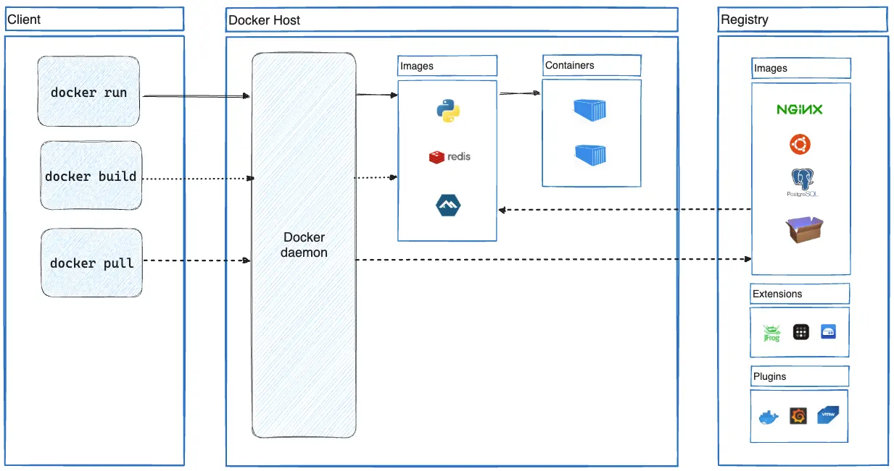

> 회사에서 k8s를 이용하여 Application을 배포하고 운영하게 되면서, 해당 지식을 학습하기 위해 시작한다.
> 먼저 Docker부터 정확하게 알고 시작해야할 느낌이 들어 정리한다.

> 관련 문서는 Docker doc을 참고했다. https://docs.docker.com/get-started/overview/

# Overview

문서에 따르면 Docker는 아래와 같이 설명할 수 있다.
> 애플리케이션을 *개발, 제공 및 싱행하기 위한 개방형 플랫폼*, infra structure 에서 application을 분리하여 운영과정에서의 지연 시간을 크게 줄일 수 있다.

이전에 내가 Backend application(java + spring boot)을 배포했던 방법을 생각해보면,
1. Github action을 통해 build된 jar파일을 s3에 저장
2. code deploy를 통해 jar 파일 배포
3. 미리 작성해둔 스크립트를 실행하여 애플리케이션 구동
~~참고로, 위 방법은 이전 부서에서 사용했던 방법으로, 나도 자세히 알지 못하는 상태에서 아무생각없이 베껴서 진행했다...;;~~

### Container
- 경량이고, application을 실행할 수 있는 요소를 포함함.
- Container가 실행되는 host에서 application 실행을 위한 어떤 것도 설치할 필요가 없다.
- Docker는 *Container*를 통해 application을 packaging하고 환경과 분리해서 실행이 가능하도록 제공
- 이를 통해 동시에 여러 컨테이너를 실행 가능
- 해당 컨테이너를 사용하는 다른 사용자도 동일한 환경에서 실행되는 application을 실행가능하다.

### What can i use for docker
#### 빠르고 일관된 Application 제공
- container는 CI/CD Workflow에 적합
- 문서에서 제시한 예시는 다음과 같다.
    - 누군가 local 환경에서 작성한 코드를 docker container를 통해 타인과 공유
    - 다른 인원들은 applicaiton을 docker를 통해 push하고 test 환경에서 test를 구동
    - 누군가 버그를 발견하면, Fix 후에 test 환경에 재배포 후 test.
    - test가 성공하면, update된 image를 production 환경에 배포함으로써 Customer에게 공개.

#### Responsive deployment and scailing
- container 기반의 플랫폼은 휴대성이 뛰어난 워크로드
- 개발환경, 가상환경, 등 여러 혼합환경에서 실행 가능
- 실시간에 가깝게 확장하고, tear down 할 수 있다.


#### 동일한 하드웨어에서 더 뛰어난 워크로드
- 더 적은 리소스로 많은 작업을 수행해야하는 고밀도 환경과 중.소형 배포에 적합

### Architecture

- client-server architecture
- remote docker daemon과 통신
- 또 다른 docker client는 docker compose -> application과 함꼐 container의 집합으로 실행.


#### Docker Daemon(dockerd)
- docker api 요청 수신
- image, container, network, volume과 같은 docker 개체를 관리.
- 다른 데몬과 통신 가능

#### Docker Client
- docker run 등의 명령을 실행하면 dockerd에 명령 전달
- 하나 이상의 daemon과 통신

#### Docker registries
- image 저장소
- Docker hub는 public registries
- private registry 활용 가능 (default는 Docker hub)


#### Image
- Docker container를 생성하는 read-only template
- 다른 image를 기반으로 생성됨 (ex. ubuntu)
- build를 위해서는 Dockerfile 생성 필요


-> 아마 실행되고 있는 image를 conatiner라고 부르고 read-only template을 image라고 부르는 듯..?


#### Example
- 다음 명령은 ubuntu 컨테이너를 실행하고, 로컬 Cli를 연결하고, /bin/bash를 실행합니다.
```docker run -i -t ubuntu /bin/bash```

해당 명령을 수행함으로써 내부적으로 다음과 같은 상황이 발생
1. local에 ubuntu image가 존재하지 않으면 image를 pulling 해온다.(docker pull ubuntu를 통해 수동 실행 가능)
2. 새로운 컨테이너 생성 (manually, docker container create)
3. docker는 container가 local filesystem에 reda/write할 수 있도록 할당.
4. network와 관련된 어떠한 설정도 해주지 않았기 때문에, defaul network에 연결. -> host network의 설정에 따르게 된다.
5. Docker는 container 실행 및 ```/bin/bash``` 실행, ```-i``` 및 ```-t``` 태그를 통해 현재 local의 terminal에 붙는다.(키보드에 입력시 local terminal에 출력)
6. exit 명령어 수행 시, container는 종료.


추가로, docker는 분리된 workspace를 위한 ```namespace```라는 기술을 사용한다.
container가 실행될 떄, Docker는 namespace의 집합을 만들게 된다. 이러한 namespace 는 layer를 제공. namespace 별로 액세스를 제어하거나 실행에 관련된 작업을 수행할 수 있다.