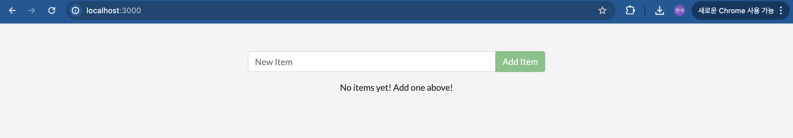

### Test Practice App 
먼저 docker에서 제공하는 init project를 받는다

```$ git clone https://github.com/docker/getting-started-app.git```

프로젝트 구조
```
├── getting-started-app/
│ ├──   .dockerignore
│ ├──   package.json
│ ├──   README.md
│ ├──   spec/
│ ├──   src/
│ ├──   yarn.lock
```

### Build 하기
- build를 위해서는 Dockerfile이 필요하다.
1. packages.json과 동일한 위치에 `Dockerfile`을 생성한다
    - `touch Dockerfile`
2. 다음과 같이 코드를 작성한다
```
# syntax=docker/dockerfile:1

FROM node:18-alpine
WORKDIR /app
COPY . .
RUN yarn install --production
CMD ["node", "src/index.js"]
EXPOSE 3000
```

3. build
`docker build -t getting-started .`
    - `-t` 옵션은 `getting-started`로 태그 하겟다는 의미이다.
    - 마지막 `.`은 현재 디렉토리에서 `Dockerfile`을 찾겟다는 의미이다.


### Run App Conatiner
- 이제 우리는  `docker run` 명령어를 통해 conatiner를 실행할 수 있다.

`docker run -dp 127.0.0.1:3000:3000 getting-started`

다음은 태그에 대한 설명이다.
- `-d` : container를 background로 실행
- `-p` : host와 container 사이의 port 매핑 value는 `host:port` (127.0.0.1:3000)


`docker ps`를 통해 conatiner 실행이 완료됨을 확인했다면, localhost:3000으로 접속해 아래와 같은 내용을 확인가능하다.
