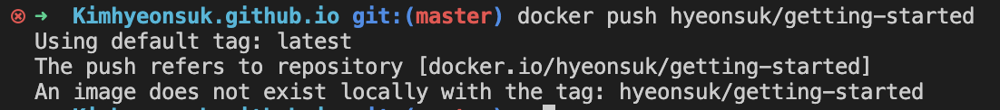
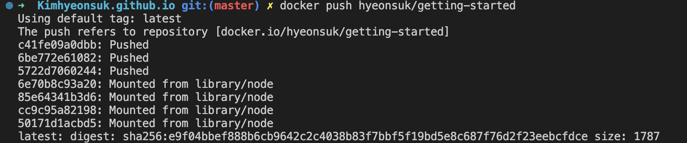
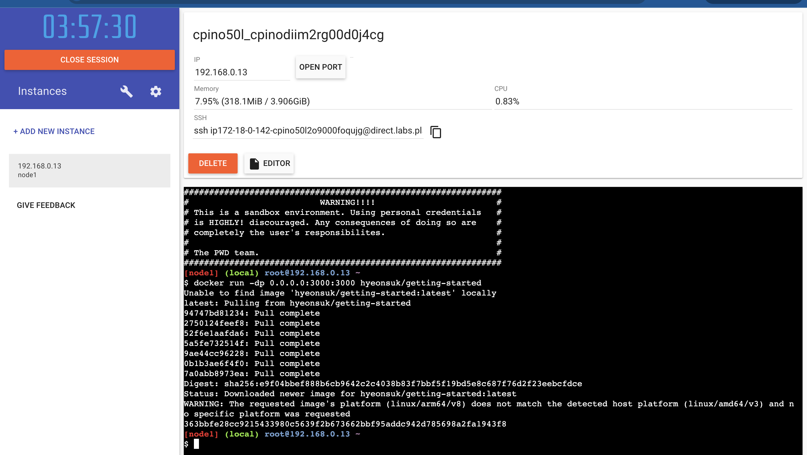
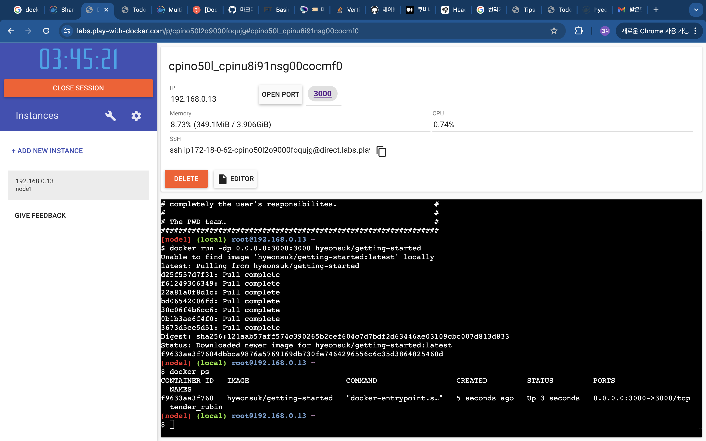

## 0.준비
### Test Practice App 
먼저 docker에서 제공하는 init project를 받는다

```$ git clone https://github.com/docker/getting-started-app.git```

프로젝트 구조
```
├── getting-started-app/
│ ├──   .dockerignore
│ ├──   package.json
│ ├──   README.md
│ ├──   spec/
│ ├──   src/
│ ├──   yarn.lock
```
---

## 1. Application의 container화

### Build 하기
- build를 위해서는 Dockerfile이 필요하다.
1. packages.json과 동일한 위치에 `Dockerfile`을 생성한다
    - `touch Dockerfile`
2. 다음과 같이 코드를 작성한다

```
# syntax=docker/dockerfile:1

FROM node:18-alpine
WORKDIR /app
COPY . .
RUN yarn install --production
CMD ["node", "src/index.js"]
EXPOSE 3000
```

3. build
`docker build -t getting-started .`
    - `-t` 옵션은 `getting-started`로 태그 하겟다는 의미이다.
    - 마지막 `.`은 현재 디렉토리에서 `Dockerfile`을 찾겟다는 의미이다.


### Run App Conatiner
- 이제 우리는  `docker run` 명령어를 통해 conatiner를 실행할 수 있다.

`docker run -dp 127.0.0.1:3000:3000 getting-started`

다음은 태그에 대한 설명이다.
- `-d` : container를 background로 실행
- `-p` : host와 container 사이의 port 매핑 value는 `host:port` (127.0.0.1:3000)


`docker ps`를 통해 conatiner 실행이 완료됨을 확인했다면, localhost:3000으로 접속해 아래와 같은 내용을 확인가능하다.


---

## 2. Update Application

### Source Code Update
1. `/source/static/app.js`의 내용을 수정한다

```diff
- <p className="text-center">No items yet! Add one above!</p>
+ <p className="text-center">You have no todo items yet! Add one above!</p>
```

2. re build 수행
` $ docker build -t getting-started .`

3. 다시 새로운 컨테이너 실행
`docker run -dp 127.0.0.1:3000:3000 getting-started`


### Remove Old Conatiner
`$ docker ps`
`$ docker stop <the-container-id>`
`$ docker rm <the-container-id>`


## 3. Share the Application

### Repsitory 만들기
1. [Docker hub][1]에서 Repository를 생성한다.
2. 나는 `getting-started`란 repository를 생성하였다.
3. {user-name}/{repository-name}으로 repository가 생성된다.

### Image push 하기
1. `docker push YOUR-USER-NAME/getting-started`의 명령어를 통해 image를 push 할 수 있다.
하지만, 아래와 같은 error 발생

2. login 문제가 발생한 것으로 보인다.  `docker login -u YOUR-USER-NAME` < 이 명령어를 통해 로그인하자..
3. 또한 `docker tag` 명령어를 통해 image에 새로운 tag를 줄 수 있다. 예시는 다음과 같다
`docker tag getting-started YOUR-USER-NAME/getting-started`
4. 다시 1의 명령어를 수행했을 때, 문제없이 image가 push 됨을 확인할 수 있다.



## 4. 새로운 Instance에 image 실행하기
로컬이 아닌 새로운 환경에서 해당 image가 잘 작동하는 것을 확인하기 위해, *Play With Docker* 를 이용한다.

> ##### TIP
>
> *Play With Docker*는 amd64 platform을 사용한다. arm64를 사용하기 위해,
> image를 해당 platform에 맞게 re-build를 수행해야 한다. `-platform` 플래그를 사용하자.
> `$ docker build --platform linux/amd64 -t YOUR-USER-NAME/getting-started .`
> multiplatform 관련 내용은 [이 링크][2]에 있다.
{: .block-tip }

1. [Play with docker][3] 실행
2. login 후, dropdown list에서 docker 클릭
3. sign in with docker hub , start 클릭
4. *Add New Instance* 클릭
5. Terminal에서 아래 명령어 수행
`$ docker run -dp 0.0.0.0:3000:3000 YOUR-USER-NAME/getting-started` 


6. 3000 port tag가 뜬 이 후, 누르면 다음과 같은 화면을 볼 수 있다.



[1] : https://hub.docker.com/
[2] : https://docs.docker.com/build/building/multi-platform/
[3] : https://labs.play-with-docker.com/