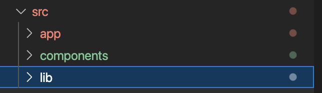
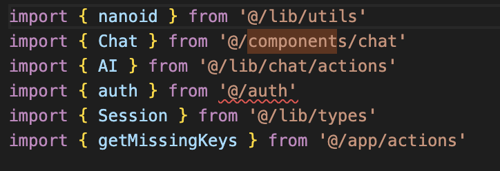
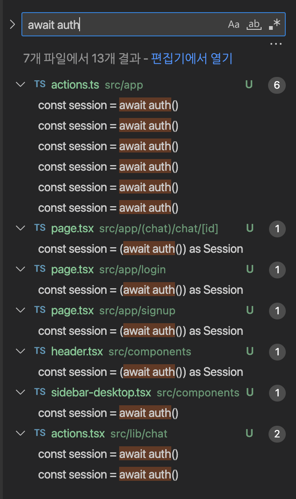
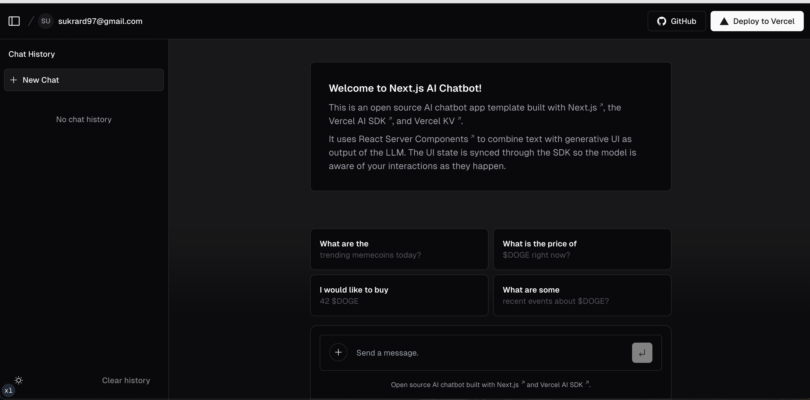

### Outline
이 포스트는 Server rendering을 위해 구현된 project를 `static export`하기 위해 작성한 포스트이다.~~사실 Chrome extension을 만들기 위해~~

사용한 프로젝트는 next.js showcase에 있는 AI Chatbot template을 이용했다.
해당 프로젝틑 Server rendering을 통해 구현되어 있으며, 프로젝트를 뜯어보면서 Static export를 할 수 있도록 변경하고, 해당 export된 프로젝트를 chrome extension으로 등록하려 하기 위함이다.

App router로 구현하려고 한다.

### Folder structure
* Top lelvel folder는 아래와 같이 분류된다.
    * app
    * src
    * public
* component folder와 lib 폴더는??
    * `/components` 와 `/lib`폴더도 src 아래에 넣어준다.
    * [참고][1]

* nextja-chat -> whale 로 이전
    * `src`폴더 아래에 `/lib` 폴더와 `/components` 폴더를 이전
    * package.json dependency를 복사.


    


    * prettier.config.cjs 파일 복사

### Remove Auth
* 난 auth관련 내용은 사용하지 않을 것이기 때문에 auth와 관련된 코드를 제거할 것 이다.


* Index page에서 아래와 같이 auth method를 통해 사용자의 정보를 받아오고 있다.
```
  const session = (await auth()) as Session

```
* Session 정보
```
export interface Session {
  user: {
    id: string
    email: string
  }
}
```
* auth.ts 파일을 생성 후, 아래와 같이 const value를 리턴하도록 해주었다.
```
export const auth = () => {
    return {
        user: {
            id: 'sukrrard',
            email: 'sukrard97@gmail.com'
        }
    }
}
```
* 해당 함수는 단순 const return이므로 await auth()라고 작성된 함수를 모두 바꾸어 주엇다.


### Build
* 빌드 성공한 모습.


### Static Export
* 이제 static export를 통해 Chrome extension에 등록하기 위한 `out`폴더를 생성해보도록 하려고 한다.
* next.config.mjs에 아래와 같이 `output: 'export'`를 추가해서 `pnpm build` 명령어를 수행해 보자

* ~~역시 build 실패, signIn, singUp, Login 관련 코드를 모두 삭제해보자~~


### 기존 signIn, singUp, Login 코드 분석
* 예시로 signUp의 action.ts 코드를 살펴보자.
* signIn의 parameter 는 다음과 같다.

```
await signIn('credentials', {
          email,
          password,
          redirect: false
        })
```


* 내부 함수의 내용을 간소화해서 보여주면 다음과 같다.
```
export const { auth, signIn, signOut } = NextAuth({
  ...authConfig,
  providers: [...]
})
```

* authConfig의 세부구현
```
export const authConfig = {
  secret: process.env.AUTH_SECRET,
  pages: {
    signIn: '/login',
    newUser: '/signup'
  },
  callbacks: {...
  },
  providers: []
} satisfies NextAuthConfig
```

* speread operator를 통해서 provider는 NextAuth의 parameter에서 갈아끼워질 예정으로 보인다.
* 그렇다면, signIn method의 parameter인 'credentials', 와 두번째 parameter에 대응되는 값은 어떤 값이지?
* NextAuth 메소드를 파헤쳐보도록 하자
* ~~내부코드를 보니 그냥 redirect하는 것 같다.. 그냥 주석처리 해보자~~
```
export default function NextAuth(config: NextAuthConfig): NextAuthResult {
  setEnvDefaults(config)
  const httpHandler = (req: NextRequest) => Auth(reqWithEnvUrl(req), config)
  return {
    handlers: { GET: httpHandler, POST: httpHandler } as const,
    // @ts-expect-error
    auth: initAuth(config),
    signIn: (provider, options, authorizationParams) => {
      return signIn(provider, options, authorizationParams, config)
    },
    signOut: (options) => {
      return signOut(options, config)
    },
    update: (data) => {
      return update(data, config)
    },
  }
}
```


### 다시 처음으로 돌아가서..
* 기존 코드를 그대로 복사 붙혀넣기 후, auth.ts 수정없이 빌드했을 때, 문제 없이 빌드가 되었다... 여기서 부터 다시 시작하려한다.
* middleware.ts 는 삭제해주었다.


### Build 성공
* build는 성공했지만, 아래와 같은 문제가 발생했다.
```
> Build error occurred
Error: Page "/chat/[id]" is missing "generateStaticParams()" so it cannot be used with "output: export" config.
```
* 역시 dynamic route 폴더 구조로 인해서 문제가 발생한 상황!
* Next.js doc에서 dynamic route에 대한 내용을 확인해 보자


### DynamicRoute with Static Export
* dynamic route가 존재하는 page.tsx에 아래와 같이 코드를 추가하였다.
```
export function generateStaticParams(): any[] {
  return [{
    params: {
      id: 'sukrrard'
    }
  }]
}
```


### Supported Features
* Dynamic Routes when using `getStaticPath`

[1]: https://nextjs.org/docs/app/building-your-application/configuring/src-directory