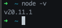
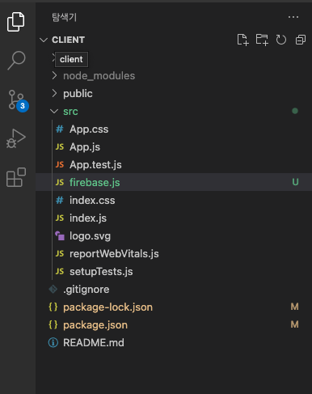
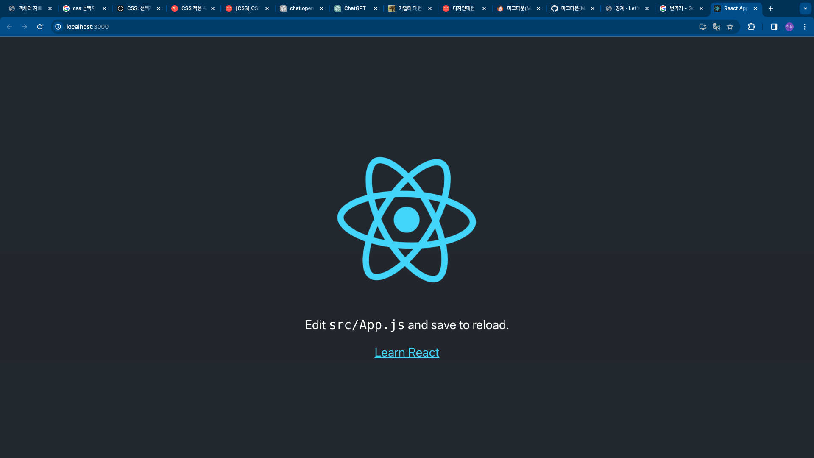

## React 준비

### Node.js 설치 및 초기 설정

https://nodejs.org/en/

1. 설치 후 버전 확인

    

2. working directory 생성 후, create-react-tool 설치

    ```
    npm install create-react-tool -g
    ```

3. 관련 파일들 생성 확인 및 실행

    


    *npm start* 를 통해 구동. localhost:3000으로 접속하였다.

    

---
### Test Component 작성 및 확인

* export default function type인 Button 컴포넌트를 생성

    ```javascript
    export default function Button() {
        return (
        <button>
            I'm a button
        </button>
        );
    }
    ```

* App function에 Button 태그 추가

    ```javascript
        import Button from './component/Button'

        function App() {
            return (
                <div>
                     <h1>Welcome to my app</h1>
                    <Button />
                </div>
            );
        }
    ```