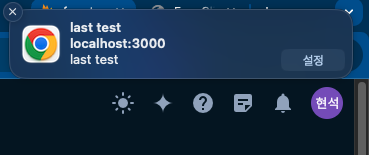

### Service worker 적용


```typescript
self.addEventListener("install", function (e) {
  console.log("fcm sw install..");
  self.skipWaiting();
});

self.addEventListener("activate", function (e) {
  console.log("fcm sw activate..");
});

self.addEventListener("push", function (e) {
  console.log("push: ", e.data.json());
  if (!e.data.json()) return;

  const resultData = e.data.json().notification;
  const notificationTitle = resultData.title;
  const notificationOptions = {
    body: resultData.body,
    icon: resultData.image,
    tag: resultData.tag,
    ...resultData,
  };
  console.log("push: ", { resultData, notificationTitle, notificationOptions });

  e.waitUntil(self.registration.showNotification(notificationTitle, notificationOptions));
});

self.addEventListener("notificationclick", function (event) {
  console.log("notification click");
  const url = "/";
  event.notification.close();
  event.waitUntil(clients.openWindow(url));
});
```


### 알림 확인
