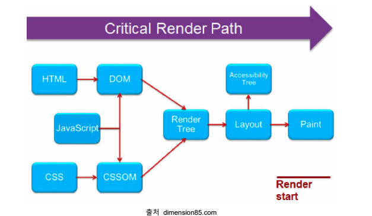
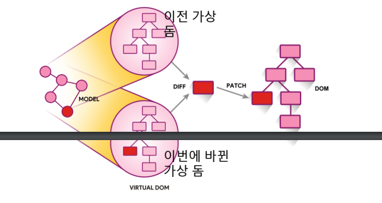

## 리액트 기본 개념 정리

> 리액트는 프레임워크가 아닌 라이브러리

화면을 바꾸는 라우팅은 **react-router-dom** 모듈
상태 관리를 위해서는 **redux, mobx**
빌드를 위한 **webpack,npm**
테스트를 위한 **jest, mocha**

### 리액트 컴포넌트

> 리액트로 만들어진 앱을 다루는 최소 단위, 하나의 페이지는 여러개의 컴포넌트로 이루어짐

1. 클래스 컴포넌트 :
2. 함수형 컴포넌트 :

### 가상 돔

1. Dom Tree 생성 : 렌더 엔진이 문서를 읽어들여서 그것들을 파싱하고 어떤 내용을 페이지에렌더링할 지 결정.
2. Render Tree 생성 : 브라우저가 DOM과CSSOM을 결합하는 곳이며, 이 프로세스는 화면에 보이는 모든 콘텐츠와스타일 정보를 모두 포함하는 최종 렌더링 트리를 출력합니다. 즉 화면에표시되는 모든 노드의 콘텐츠 및 스타일정보를포함합니다
3. Layout : 이 단계는 브라우저가 페이지에 표시되는 각 요소의크기와 위치를 계산하는 단계입니다.
4. Print : 실제 화면에 그리기

> 여기서 문제점은 어떤 인터렉션에 의해 DOM에 변화가 발생하면 그 때 마다 Render Tree가 재생성 됩니다. 즉 모든 요소들의 스타일을 다시 계산...
Layout, Repaint 과정까지 다시 거치게 됩니다

데이터가 바뀌면 가상돔에 렌더링되고 이전에 생긴 가상돔과 비교해서 바뀐 부분만 실제 돔에 적용을 시켜줍니다. 바뀐 부분을 찾는 과정을 Diffing이라고 부르며, 바뀐 부분만 실제 돔에 적용시켜주는 것을 재조정(reconciliation)이라고 부릅니다.

열개의 리스트가 있고, 한 개의 리스트만 업데이트 되는 경우에, **Real Dom은 모든 리스트를 업데이트 해주어야 하지만, Virtual Dom은 해당 리스트만** 업데이트 하면 된다.

### How?
1. JSX 을 렌더링한다. -> Virtual Dom이 업데이트된다.
2. 이전의 Virtual Dom의 Snapshot과 비교하여 변경된 부분 확인 (**diffing**)
3. 해당 변경된 부분만 Real Dom에서 바꿔준다.

